# 🔄 Migration test dashboard — mockup

A static rendering of what the ideal migration-test report could look like in
GitHub's markdown renderer. Each section probes a different diagram type to
see which actually render in GitHub's pinned Mermaid.

Data is realistic-fake, modeled after a typical run of the integration suite.

---

## Headline

> 🔴 **1 regression**   🟢 **1 recovery**   ⏱ post is **490ms faster**   📐 step coverage: **92% → 88%**

## Pre vs Post summary

| Metric | Pre-upgrade | Post-upgrade | Δ |
|---|---|---|---|
| Tests 📝 | 12 | 12 | 0 |
| Passed ✅ | 10 | 10 | 0 |
| Failed ❌ | 1 | 1 | 0 |
| Skipped ⏭️ | 1 | 1 | 0 |
| Flaky 🍂 | 1 | 2 | +1 |
| Duration ⏱️ | 5.49s | 5.00s | -490ms |

## 🔴 Regressed (passed → failed)

| Test | Pre | Post | Duration |
|---|---|---|---|
| [Schema column type](https://github.com/jonhermansen/bdd-reporting-demo/blob/main/components/integration/features/items.feature#L57) | ✅ pass | ❌ AssertionError: schema column type changed unexpectedly | 130ms → 66ms |

## 🟢 Recovered (failed → passed)

| Test | Pre | Post | Duration |
|---|---|---|---|
| [Known issue](https://github.com/jonhermansen/bdd-reporting-demo/blob/main/components/integration/features/items.feature#L61) | ❌ index missing on legacy schema | ✅ pass | 188ms → 179ms |

## 🍂 Tests that needed retries

| Test | Pre attempts | Post attempts |
|---|---|---|
| [Network jitter retries cleanly](https://github.com/jonhermansen/bdd-reporting-demo/blob/main/components/integration/features/items.feature#L43) | 1 attempt | 3 attempts |
| [Occasionally flaky — UI render timing](https://github.com/jonhermansen/bdd-reporting-demo/blob/main/components/integration/features/items.feature#L23) | 2 attempts | 1 attempt |

---

## Where did the time go? (Treemap)

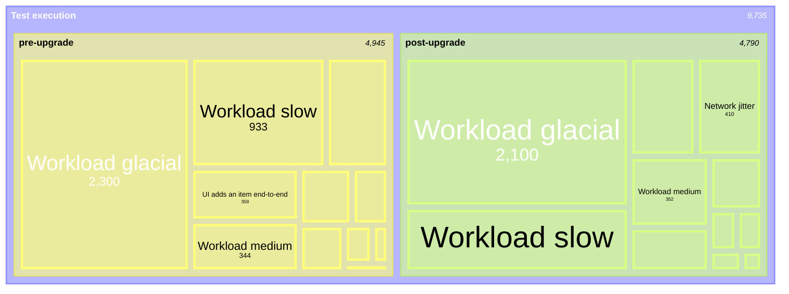

(Fallback if treemap doesn't render)

---

## Execution timeline (Gantt)

```mermaid
gantt
    title Test execution timeline (ms)
    dateFormat x
    axisFormat %S.%L
    section Pre-upgrade
    Backend health check     :0, 38
    API create and list      :38, 107
    UI adds an item          :107, 466
    UI render timing         :466, 898
    Workload fast            :898, 921
    Workload medium          :921, 1265
    Workload slow            :1265, 2198
    Workload glacial         :2198, 4498
    Network jitter           :4498, 4627
    Schema column type       :4627, 4757
    Known issue              :4757, 4945
    section Post-upgrade
    Backend health check     :5000, 5042
    API create and list      :5042, 5113
    UI adds an item          :5113, 5333
    UI render timing         :5333, 5744
    Workload fast            :5744, 5772
    Workload medium          :5772, 6124
    Workload slow            :6124, 7035
    Workload glacial         :7035, 9135
    Network jitter           :9135, 9545
    Schema column type       :9545, 9611
    Known issue              :9611, 9790
```

---

## Pass/fail breakdown (Pie)

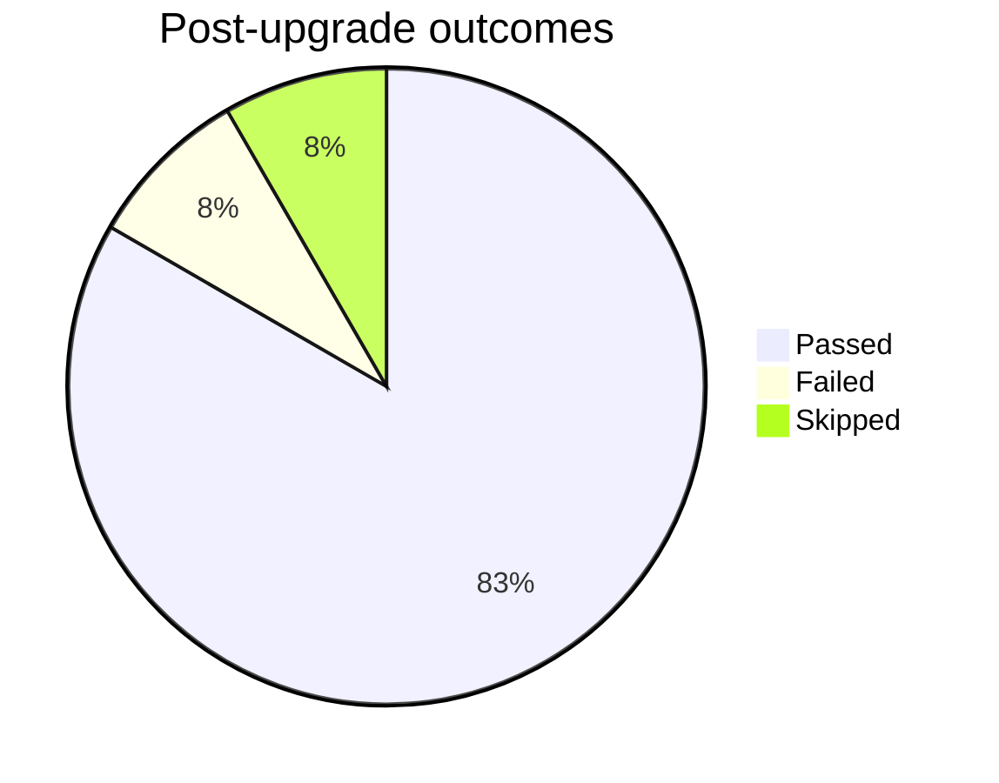

---

## Phase comparison (xychart-beta)

```mermaid
xychart-beta
    title "Per-test duration: pre vs post (ms)"
    x-axis [Backend, API, UI-add, UI-render, fast, medium, slow, glacial, jitter, schema, known]
    y-axis "Duration (ms)" 0 --> 2500
    bar [38, 69, 359, 432, 23, 344, 933, 2300, 129, 130, 188]
    bar [42, 71, 220, 411, 28, 352, 911, 2100, 410, 66, 179]
```

---

## Test-set diff flow (Sankey-beta)

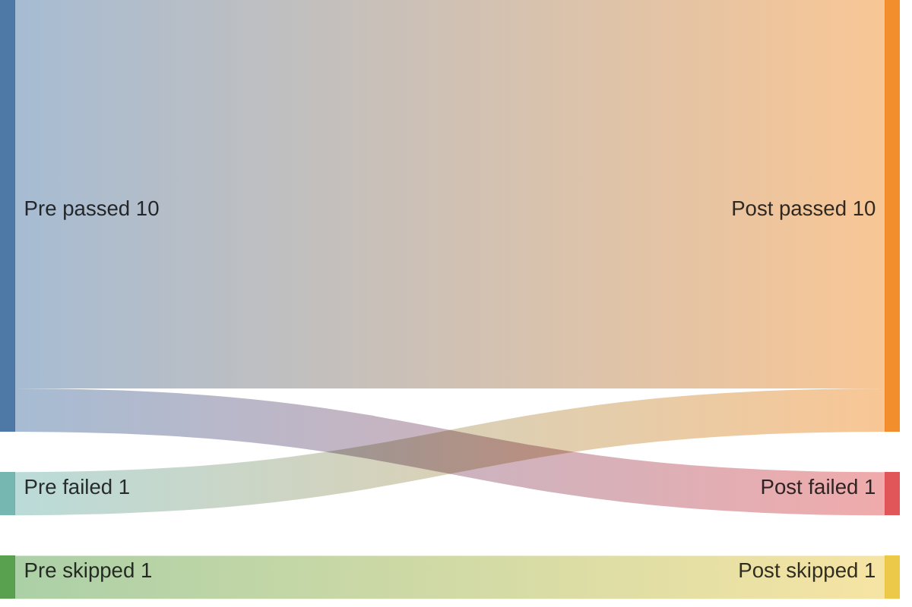

---

## Drill-down (nested details)

<details>
<summary>📂 components/integration/features/items.feature (post-upgrade)</summary>

<details>
<summary>❌ <b>Schema column type — passes pre, fails post</b> · 66ms</summary>

| Step | Status | Duration | Definition |
|---|---|---|---|
| When a migration-sensitive operation runs | ❌ | 66ms | [steps.ts:102](https://github.com/jonhermansen/bdd-reporting-demo/blob/main/components/integration/steps/steps.ts#L102) |

```text
AssertionError [ERR_ASSERTION]: post-upgrade regression: schema column type changed unexpectedly
    at StackWorld.<anonymous> (steps.ts:78:16)
```

</details>

<details>
<summary>✅ <b>Known issue — fails pre, fixed post</b> · 179ms</summary>

| Step | Status | Duration | Definition |
|---|---|---|---|
| When a previously-broken operation runs | ✅ | 179ms | [steps.ts:109](https://github.com/jonhermansen/bdd-reporting-demo/blob/main/components/integration/steps/steps.ts#L109) |

</details>

<details>
<summary>✅ <b>Backend health check</b> · 42ms</summary>

| Step | Status | Duration | Definition |
|---|---|---|---|
| Given the backend is reachable | ✅ | 18ms | [steps.ts:28](https://github.com/jonhermansen/bdd-reporting-demo/blob/main/components/integration/steps/steps.ts#L28) |
| Then the health endpoint returns ok | ✅ | 24ms | [steps.ts:32](https://github.com/jonhermansen/bdd-reporting-demo/blob/main/components/integration/steps/steps.ts#L32) |

</details>

</details>

---

## Performance tracing experiments

### Inline sparklines using Unicode blocks

| Test | Last 8 runs | p50 | p95 | Trend |
|---|---|---|---|---|
| Backend health check | ▁▁▂▁▁▂▁▁ | 38ms | 52ms | stable |
| UI adds an item | ▂▃▅█▅▃▂▂ | 220ms | 460ms | spike on r4 |
| Workload glacial | ▆▆▇▇▆▇█▇ | 2200ms | 2480ms | drift up |
| Schema column type | ▁▁▁█████ | 100ms | 130ms | hard fail since r4 |
| Network jitter | ▁▂▁▃▂▁█▁ | 130ms | 410ms | retry-noisy |

### Step-level waterfall (Mermaid gantt as substep tracing)

```mermaid
gantt
    title "Schema column type — step-by-step trace"
    dateFormat x
    axisFormat %S.%L
    section Pre-upgrade (130ms total)
    When a migration-sensitive operation runs : 0, 130
    section Post-upgrade (66ms total, FAILED)
    When a migration-sensitive operation runs : 0, 66
```

### Multi-scenario waterfall

```mermaid
gantt
    title "Pre-upgrade run — scenarios + their steps"
    dateFormat x
    axisFormat %S.%L

    section Backend health check (38ms)
    Given the backend is reachable      : 0, 12
    Then the health endpoint returns ok : 12, 38

    section API create and list (69ms)
    When I POST an item                 : 38, 78
    Then GET /api/items includes it     : 78, 107

    section UI adds an item (359ms)
    When I open the UI                  : 107, 232
    And I add an item via the UI        : 232, 384
    Then the item appears in the list   : 384, 466

    section UI render timing (432ms, flaky)
    When I open the UI                  : 466, 580
    Then heading eventually appears     : 580, 898
```

### Hot path / Top-N slowest

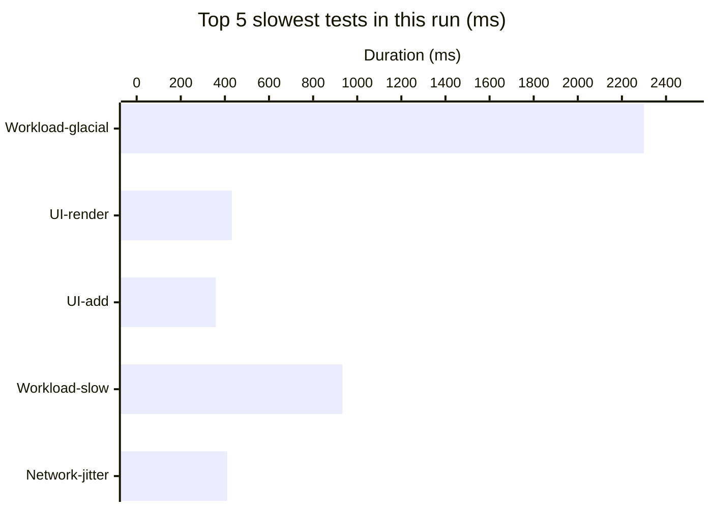

### Distribution view (if we had history)

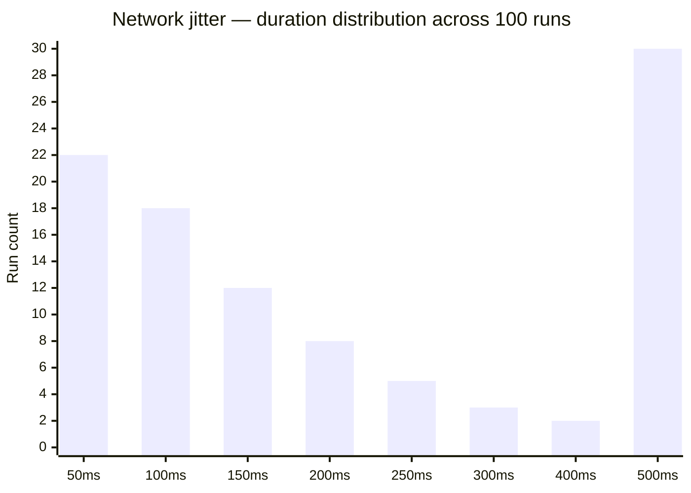

### "Flame" via stacked Mermaid

> ⚠ Mermaid doesn't have a native flamegraph; closest is a stacked horizontal gantt.
> For a real flamegraph we'd render SVG → PNG → embed as data URI. See bottom of file.

---

## Nesting experiments

### Nested expandable rows (Phase → Feature → Scenario → Steps)

This is the layout you described: each level is a clickable summary row;
expanding reveals the next level. Steps are the leaf and render as a table.
Default state is fully collapsed — click into what you care about.

<details>
<summary>📋 <b>pre-upgrade</b> · 5.49s · 12 tests · 10 ✅ · 1 ❌ · 1 ⏭ · 1 🍂</summary>

<blockquote>

<details>
<summary>📂 <b>features/items.feature</b> · 12 scenarios</summary>

<blockquote>

<details>
<summary>✅ Backend health check · 38ms</summary>

| Step | Status | Duration | Definition |
|---|---|---|---|
| Given the backend is reachable | ✅ | 12ms | [steps.ts:28](#) |
| Then the health endpoint returns ok | ✅ | 26ms | [steps.ts:32](#) |

</details>

<details>
<summary>✅ API create and list · 69ms</summary>

| Step | Status | Duration | Definition |
|---|---|---|---|
| When I POST an item named "thingamajig" | ✅ | 40ms | [steps.ts:36](#) |
| Then GET /api/items includes "thingamajig" | ✅ | 29ms | [steps.ts:40](#) |

</details>

<details>
<summary>🟡 UI render timing — passed on attempt 2 · 432ms total</summary>

**Attempt 1** ❌ (218ms) — `simulated render timeout`
**Attempt 2** ✅ (214ms)

| Step (final attempt) | Status | Duration | Definition |
|---|---|---|---|
| When I open the UI | ✅ | 91ms | [steps.ts:46](#) |
| Then the heading "Items" eventually appears | ✅ | 123ms | [steps.ts:63](#) |

</details>

<details>
<summary>❌ Known issue — fails pre, fixed post · 188ms</summary>

| Step | Status | Duration | Definition |
|---|---|---|---|
| When a previously-broken operation runs | ❌ | 188ms | [steps.ts:109](#) |

```text
AssertionError: known pre-upgrade issue: index missing on legacy schema
    at StackWorld.<anonymous> (steps.ts:84:16)
```

</details>

<details>
<summary>⏭ Pending feature — surfaced in Skipped report · 1ms</summary>

Marked `@wip` — Before-hook returned "skipped".

</details>

</blockquote>

</details>

</blockquote>

</details>

<details>
<summary>📋 <b>post-upgrade</b> · 5.00s · 12 tests · 10 ✅ · 1 ❌ · 1 ⏭ · 0 🍂</summary>

<blockquote>

<details>
<summary>📂 <b>features/items.feature</b> · 12 scenarios</summary>

<blockquote>

<details>
<summary>❌ <b>Schema column type — passes pre, fails post</b> · 66ms · <em>REGRESSION</em></summary>

| Step | Status | Duration | Definition |
|---|---|---|---|
| When a migration-sensitive operation runs | ❌ | 66ms | [steps.ts:102](#) |

```text
AssertionError: post-upgrade regression: schema column type changed unexpectedly
    at StackWorld.<anonymous> (steps.ts:78:16)
```

> ⚠ This test passed in pre-upgrade (130ms). The upgrade introduced this failure.

</details>

<details>
<summary>✅ <b>Known issue — fails pre, fixed post</b> · 179ms · <em>RECOVERY</em></summary>

| Step | Status | Duration | Definition |
|---|---|---|---|
| When a previously-broken operation runs | ✅ | 179ms | [steps.ts:109](#) |

> ✨ This test was failing in pre-upgrade. The upgrade fixed it.

</details>

<details>
<summary>✅ Backend health check · 42ms</summary>

| Step | Status | Duration | Definition |
|---|---|---|---|
| Given the backend is reachable | ✅ | 18ms | [steps.ts:28](#) |
| Then the health endpoint returns ok | ✅ | 24ms | [steps.ts:32](#) |

</details>

</blockquote>

</details>

</blockquote>

</details>

### Indented bullet tree

- 📁 Run 142
  - 📋 pre-upgrade phase
    - 📂 features/items.feature
      - ✅ Backend health check (38ms)
      - ✅ API create and list (69ms)
      - ✅ UI adds an item (359ms)
      - 🟡 UI render timing — flaky, passed on attempt 2 (432ms)
      - ❌ Known issue — fails pre, fixed post (188ms)
      - ⏭ Pending feature (skipped)
  - 📋 post-upgrade phase
    - 📂 features/items.feature
      - ✅ Backend health check (42ms)
      - ❌ Schema column type — passes pre, fails post (66ms)
      - ✅ Known issue — fails pre, fixed post (179ms)

### Mindmap (Mermaid)

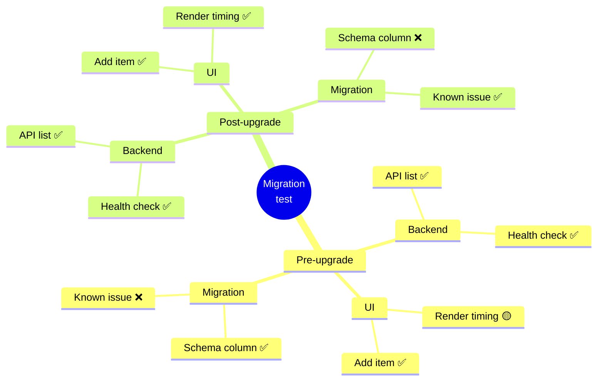

### Timeline (Mermaid)

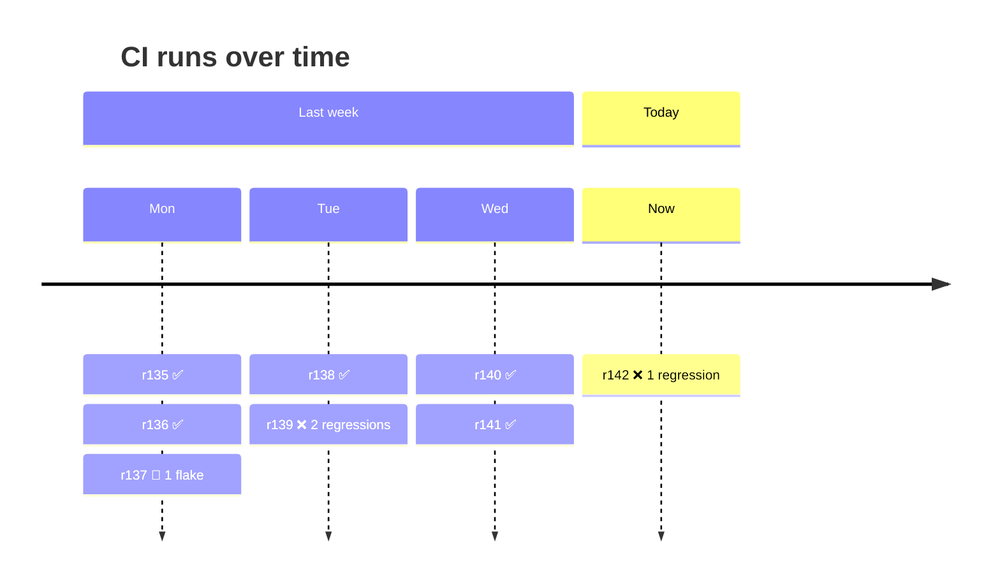

### Tabular nesting (does GFM allow nested tables?)

| Phase | Detail |
|---|---|
| pre | <table><tr><td>Tests: 12</td><td>Passed: 10</td></tr></table> |
| post | <table><tr><td>Tests: 12</td><td>Passed: 10</td></tr></table> |

(Probably won't render as a true nested table — GitHub usually flattens.)

### Code block as ASCII tree (always renders)

```text
Run 142
├── pre-upgrade  5.49s  ❌ 1 failed  🍂 1 flaky
│   ├── ✅ Backend health check               38ms
│   ├── ✅ API create and list                69ms
│   ├── ✅ UI adds an item                   359ms
│   ├── 🟡 UI render timing (×2)             432ms
│   ├── ⚡ Workload buckets (×4)            3.6s
│   ├── 🟡 Network jitter (×1)               129ms
│   ├── ❌ Known issue                       188ms  ← was failing pre, expected
│   ├── ⏭ Pending feature                     1ms
│   └── ✅ Schema column type                130ms  ← passing pre
└── post-upgrade  5.00s  ❌ 1 failed
    ├── ✅ Backend health check               42ms
    ├── ✅ API create and list                71ms
    ├── ✅ UI adds an item                   220ms
    ├── ✅ UI render timing                  411ms
    ├── ⚡ Workload buckets (×4)            3.4s
    ├── 🟡 Network jitter (×3)               410ms
    ├── ✅ Known issue                       179ms  ← recovered
    ├── ⏭ Pending feature                     1ms
    └── ❌ Schema column type                 66ms  ← REGRESSED
```

---

## Coverage delta

| File | Pre | Post | Δ |
|---|---|---|---|
| `components/integration/features/items.feature` | 92% (24/26 steps) | 88% (23/26 steps) | -4% |
| `components/integration/steps/steps.ts` | 87% | 81% | -6% |

> ⚠ One scenario in post-upgrade exited early due to the schema-column-type regression, leaving its remaining steps unexercised. The drop is expected.

---

## What renders here, what doesn't

After this file is pushed, GitHub will render whatever its pinned Mermaid
version supports and silently swallow / display "Diagram syntax error" for
the rest. The probable order of working → not:

- `pie` ✅ (stable since Mermaid 8.x)
- `gantt` ✅ (stable since Mermaid 8.x)
- `sankey-beta` ✅ (Mermaid 10.x)
- `xychart-beta` ⚠ (Mermaid 10.6+)
- `treemap-beta` ❓ (Mermaid 11.x — depends on GitHub's pinned version)

Anything that doesn't render falls back to a code block — still readable, just not pretty.

---

## 64-core parallel gantt experiment

Synthetic data: 64 worker cores, 1-3 cucumber scenarios each, 0-3000ms total
window. Renders the start/stop of every test in every lane so you can see
both **execution order** (within a lane, top-to-bottom and left-to-right)
and **parallelism** (across lanes, vertically).

Will it be readable? That's what we're finding out.

```mermaid
gantt
    title 64-core parallel test execution
    dateFormat x
    axisFormat %S.%L
    section Core 01
    Workload fast : 81, 132
    section Core 02
    Known issue : 64, 186
    Schema column type : 186, 371
    UI add : 371, 558
    section Core 03
    Workload medium : 97, 666
    API create and list : 666, 706
    Workload medium : 706, 1252
    section Core 04
    Known issue : 17, 100
    UI render : 100, 333
    section Core 05
    Pending feature : 94, 200
    section Core 06
    Network jitter : 62, 232
    Schema column type : 232, 419
    section Core 07
    Network jitter : 70, 180
    API create and list : 180, 249
    API create and list : 249, 282
    section Core 08
    Workload glacial : 42, 2134
    Known issue : 2134, 2200
    section Core 09
    UI add : 85, 457
    section Core 10
    Known issue : 56, 173
    Workload medium : 173, 439
    Schema column type : 439, 506
    section Core 11
    Known issue : 68, 155
    Pending feature : 155, 363
    Schema column type : 363, 555
    section Core 12
    API create and list : 69, 141
    Workload glacial : 141, 2247
    section Core 13
    Pending feature : 73, 243
    section Core 14
    Known issue : 0, 145
    Network jitter : 145, 209
    UI render : 209, 337
    section Core 15
    Pending feature : 6, 184
    section Core 16
    API create and list : 82, 124
    section Core 17
    Backend health check : 37, 107
    section Core 18
    Workload fast : 41, 83
    Workload slow : 83, 1009
    API create and list : 1009, 1084
    section Core 19
    Schema column type : 19, 213
    section Core 20
    Workload glacial : 3, 2361
    Backend health check : 2361, 2435
    section Core 21
    Workload fast : 45, 80
    Pending feature : 80, 314
    section Core 22
    Workload fast : 56, 163
    section Core 23
    Workload slow : 93, 1215
    Workload glacial : 1215, 3000
    section Core 24
    UI render : 23, 272
    Network jitter : 272, 481
    Known issue : 481, 566
    section Core 25
    Backend health check : 10, 42
    section Core 26
    Network jitter : 54, 218
    section Core 27
    Workload glacial : 99, 2536
    section Core 28
    Pending feature : 35, 139
    UI render : 139, 313
    UI add : 313, 584
    section Core 29
    UI render : 47, 336
    section Core 30
    Backend health check : 52, 105
    Pending feature : 105, 187
    section Core 31
    Backend health check : 14, 68
    UI add : 68, 424
    Schema column type : 424, 644
    section Core 32
    API create and list : 71, 123
    section Core 33
    Pending feature : 96, 240
    section Core 34
    UI add : 83, 252
    section Core 35
    Backend health check : 0, 89
    Workload slow : 89, 1219
    Workload medium : 1219, 1475
    section Core 36
    Backend health check : 11, 55
    UI render : 55, 456
    section Core 37
    API create and list : 46, 119
    UI add : 119, 521
    Network jitter : 521, 582
    section Core 38
    Workload fast : 81, 105
    Schema column type : 105, 244
    UI add : 244, 347
    section Core 39
    Schema column type : 44, 262
    Workload fast : 262, 352
    UI render : 352, 678
    section Core 40
    UI render : 92, 379
    section Core 41
    Network jitter : 32, 118
    Workload medium : 118, 377
    Workload glacial : 377, 2750
    section Core 42
    Workload medium : 24, 580
    section Core 43
    UI add : 8, 280
    Workload slow : 280, 1151
    Workload fast : 1151, 1235
    section Core 44
    UI add : 12, 336
    UI render : 336, 679
    section Core 45
    Backend health check : 3, 77
    Workload slow : 77, 1080
    section Core 46
    UI add : 84, 441
    Workload slow : 441, 1520
    section Core 47
    Workload medium : 23, 309
    UI render : 309, 559
    UI render : 559, 690
    section Core 48
    Workload medium : 27, 508
    section Core 49
    Network jitter : 85, 200
    section Core 50
    Pending feature : 49, 234
    UI render : 234, 651
    section Core 51
    Backend health check : 59, 123
    Workload glacial : 123, 2087
    section Core 52
    Schema column type : 54, 297
    section Core 53
    UI add : 76, 366
    UI add : 366, 723
    section Core 54
    Schema column type : 0, 242
    Backend health check : 242, 316
    Network jitter : 316, 487
    section Core 55
    Workload glacial : 47, 2491
    Schema column type : 2491, 2548
    Workload medium : 2548, 2828
    section Core 56
    Workload slow : 56, 1269
    section Core 57
    API create and list : 97, 178
    Known issue : 178, 425
    section Core 58
    Backend health check : 78, 116
    Workload slow : 116, 1400
    Network jitter : 1400, 1563
    section Core 59
    Workload slow : 8, 1137
    section Core 60
    Workload fast : 15, 81
    Schema column type : 81, 274
    section Core 61
    Pending feature : 5, 165
    section Core 62
    Workload glacial : 81, 2129
    Backend health check : 2129, 2210
    API create and list : 2210, 2264
    section Core 63
    Workload slow : 56, 909
    API create and list : 909, 960
    section Core 64
    API create and list : 19, 93
    Network jitter : 93, 246

```

### Smaller comparison: 8-lane version

For visual reference if 64 turns out too dense.

```mermaid
gantt
    title 8-core test execution (reference)
    dateFormat x
    axisFormat %S.%L
    section Core 1
    Backend health check : 0, 38
    Workload medium      : 38, 410
    section Core 2
    API create and list  : 0, 71
    UI render timing     : 71, 480
    section Core 3
    UI add               : 0, 359
    Workload fast        : 359, 412
    section Core 4
    Workload slow        : 0, 933
    Network jitter       : 933, 1063
    section Core 5
    Workload glacial     : 0, 2300
    section Core 6
    Schema column type   : 0, 130
    Known issue          : 130, 318
    section Core 7
    UI render timing     : 0, 432
    section Core 8
    Workload medium      : 0, 344
    UI add               : 344, 700
```

### Things to look for when GitHub renders this

- **Lane labels** — does the "Core 01..64" prefix render clearly on the left, or get clipped?
- **Bar widths** — when a test is 30ms in a 3000ms window, does it become an unreadable hairline?
- **Vertical scrolling** — 64 lanes × ~25px/row ≈ 1600px tall. Does GitHub clip at some height?
- **Color coding** — Mermaid auto-colors; can we hint priority (regressions in red, etc.)? The default theme uses light blues which doesn't say much.
- **Text overlap** — short test names should fit; long ones may collide with adjacent bars.

### Alternatives if Mermaid gantt at this scale is unreadable

- **Aggregated per-core summary** — a flat table showing "Core 01: 1.4s utilized, 3 tests" without rendering individual bars. Loses ordering but stays compact.
- **Real timeline chart as PNG** — generate via vega-lite / observable plot / d3, embed as data URI. Pixel-perfect layout, no Mermaid limitations, but adds a build step.
- **HTML `<canvas>` viewer published to gh-pages** — interactive zoom/pan, real flamegraph-class tooling. Heaviest lift, best UX.
